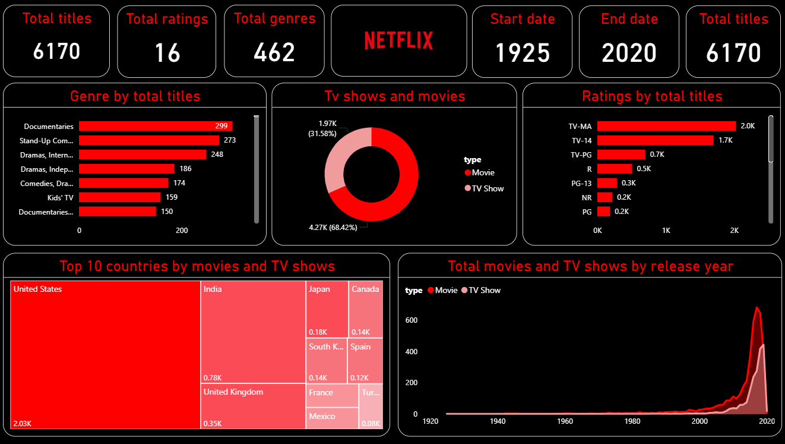

# Netflix Movies Power BI Dashboard

This project is focused on building a Power BI dashboard to analyze Netflix’s movie and TV show catalog. The goal is to explore patterns in content type, ratings, genres, country distribution, and release timelines. The dashboard is designed to present clear, structured insights using interactive visuals.

It includes:

- Total number of titles by genres
- Breakdown of movies vs TV shows
- Ratings distribution (TV-MA, TV-14, R, PG-13, etc.)
- Top countries by content volume
- Most common genres
- Growth of content over time

---

---

## Files Included

- `dataset.csv` – Source dataset
- `netflix_dashboard.pbix` – Power BI dashboard file
- `final_dashboard.png` – Dashboard image
- `netflix_logo.png` – Netflix logo used in the report

## How to View

1. Download or clone this repository.
2. Open `netflix_dashboard.pbix` in Power BI Desktop.
3. Explore the visuals and filters.

## About

Created by Akilla Kavinda Herath  
This is a hands-on Power BI project built to improve dashboard design and data storytelling skills.
